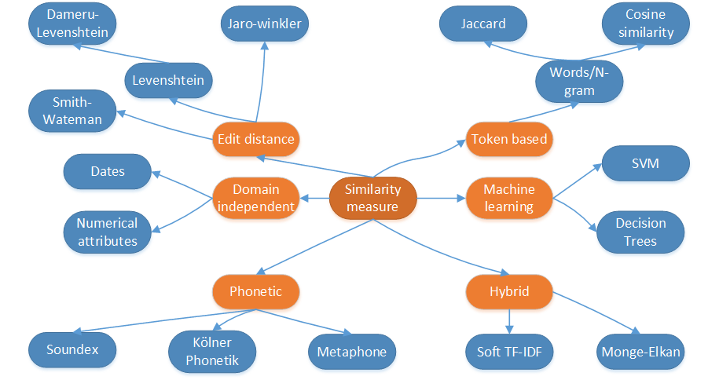

# entity_resolution_spark
Collection of some algorithms for entity resolution on string attribute

Written in python. 

Refer howtoguide for the overview of features. 

Complements the algorithms presents in jellyfish package of python.

Edit distance (s,t): The number of minimum edit operation (Insertion,Deletion,Substitution) to tranform s to t. Each operation are wieghted. 

Affine gap: A+(B⋅L). A is the cost of opening the gap. B is the gap extension penality and L is the length of the gap.  

*Image adopted from Naumann, F. (2013). Similarity measure. Personal collection of F. Naumann, Hasso-Plattner-Institut, Potsdam,Germany

|Algorithm| example|score | scoreApplicability|
|---------|--------|------|---------------|
|Levenshtein|leven("Peter","Pteer")|0.6| Hello world of approx. matching. Many extensions are possible|
|Damareu-Levenshtein|dl("Peter","Pteer")|0.8| Transposition of adjacent character extension of Levenshtein|
|Jaro-winkler|jaro_winkler("paul johnson","johson paule")| 0.47|works best for small words (First name or last name), works best on census names [1]|
|Monge-Eklan| monge_score("paul johnson","johson paule")|0.94| Best of the character based method [1]|
|cosine similarity| Depends on tf-idf weights of terms | depends on number of documets in collection| Similar to search engine. Good results for phrase queries. Can be extended  for topic modelling as well |
|N-gram cosine similarity|Depends on tf-idf weights of terms||By generating n-gram of the query and the document, we increase the similarity score as both share lot of tokens in common. Suitable for small documents like database text|
|Soft Tf-idf | depends on TF-idf weight of terms in collection |depends on number of documets in collection|handles tokens with smaller corrections |

Refer equations.pdf for the algorithm formulation.

Once the Needleman-Wunch and Smith-Watermann algorithms are implmented , I will refactor the code and release it as a package.

To apply this algorithms on spark is a five simple steps process,

Step1 : Read two input sources containing data in format id,'string1','string2'

Step2 : Perform pre-processing hacks like lowercase conversion, removing unwanted characters. 

2a. If algorithms requires Tf-idf scores, generate it here and distribute the wieghts

Step3 : Take the cross product of the data sources. # cartesian product

Step4 : Apply the differnt algorithm based on application needs

Step 5 : Filter the results based a threshold. A good threshold value can be determined by ROC curve if you have golden dataset. Else start with a lower threshold and experiment.

Step6 : Transform the dataset to the form (idsrc1,idscr2,avg.score) and write the results.

Refer spark_template.py for applying the algorithm in distributed system.

Further development:

1. Machine learning algorithms based on score functions (SVM, decision tress)
2. BM25 algorithm for probabilitic interepresentation of matching algorithm instead of cosine score

Reference
1. Cohen, W., Ravikumar, P., & Fienberg, S. (2003, August). A comparison of string metrics for matching names and records. In Kdd workshop on data cleaning and object consolidation (Vol. 3, pp. 73-78). 
2. Naumann, F., & Herschel, M. (2010). An introduction to duplicate detection. Synthesis Lectures on Data Management, 2(1), 1-87. 
3. A. K. Elmagarmid, P. G. Ipeirotis, and V. S. Verykios, “Duplicate record detection: A survey,”
Knowledge and Data Engineering, IEEE Transactions on, vol. 19, no. 1, pp. 1–16, 2007.

